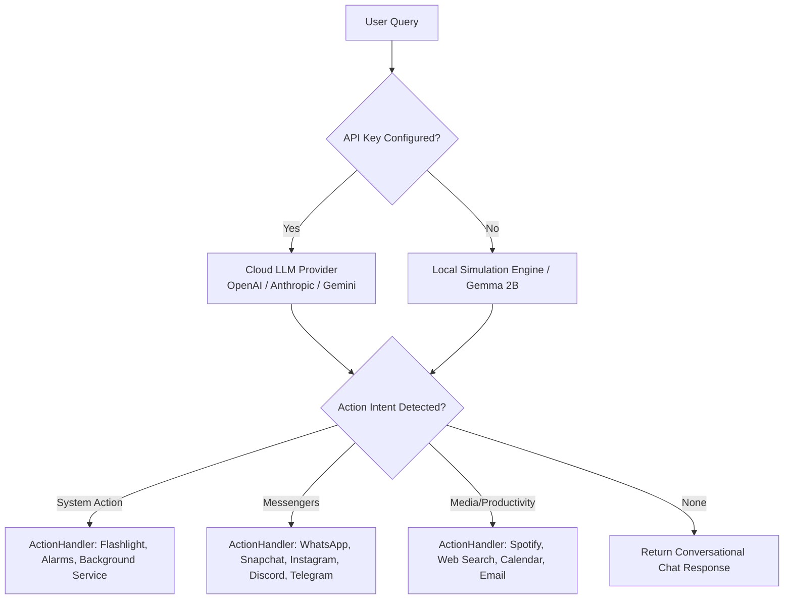

<div align="center">

# 🤖 On-Device AI Agent

**A native Android automation assistant that manages your device natively. Run powerful LLMs via API, or switch to the Fully Offline Simulated Agent engine to execute mock profiles of industry-leading AI agents (OpenHands, CrewAI, AutoGen) right on your phone.**

[](https://developer.android.com/)
[](https://kotlinlang.org/)
[](https://developer.android.com/jetpack/compose)
[](LICENSE)
[](https://github.com/testencomnom-collab/on-device-agent/releases)

<br>

[](https://github.com/testencomnom-collab/on-device-agent/raw/main/releases/synaptiq-ai-agent-V18.5.apk)

</div>

---

> [!CAUTION]
> <span style="color:red">**Urgent Security Notice**</span>
> 
> It is **highly recommended** to always download the latest version of this app (via APK or source code) and keep your dependencies up to date. Outdated versions may contain known **security vulnerabilities (CVEs)** that could compromise your device and data. We continuously patch these vulnerabilities through updates. Never use old, unsupported builds.

## 🌟 Vision & Overview
Welcome to the future of mobile assistance! The **On-Device AI Agent** acts as an intelligent bridge between advanced Large Language Models (LLMs) and your Android device's native ecosystem. Whether you're connected to the cloud or completely offline, this agent seamlessly parses conversational language and executes real actions on your smartphone—from sending WhatsApp messages to tweaking system settings.

---

## ✨ Key Features

1. 📲 **Messenger Automation**  
   Full deep-link and intent integration to directly send messages via **WhatsApp, Snapchat, Instagram, Telegram, and Discord**.
   
2. 🔦 **Hardware & System Utilities**  
   Voice-driven control over hardware functions like **Flashlight**, managing **Alarms & Timers**, seamless **Spotify playback**, and fast **Web Searches**.
   
3. 🧠 **True On-Device LLM (Gemma 2B)**  
   Download and run the actual **1.35 GB Gemma 2B model** via MediaPipe. The processing happens entirely offline without requiring an internet connection—guaranteeing 100% privacy.

4. 🧠 **Contextual Memory (Long-term Storage)**  
   **This feature is fully implemented!**  
   **How it works:** The AI permanently stores specific facts about you (e.g., names of your friends, your workplace, your favorite music) in a secure Room database. Through a new brain icon (Brain UI) in the app's top bar, you can view all memories the AI has learned in real-time, delete them individually using the trash icon, or completely reset the memory.

5. 🎨 **Beautiful Modern UI & Multilanguage**  
   A sleek, dark-mode focused UI with a brand new custom app icon, dynamic animations, and premium glassmorphic elements. 
   **Multilanguage:** The app and the LLM dynamically support both English and German, without mixing languages.

6. 🔌 **Fully Offline Simulated Agents**  
   Download JSON configurations for complex frameworks like **OpenHands, Goose, Browser-Use, CrewAI, and Flowise**. The app simulates how these complex AI workflows operate on a mobile layout.

7. 📱 **Mobile Automation Engine**  
   Automatically parses complex user intents (like "Book a flight on Tuesday and invite John") to execute complex system actions like booking calendar events or drafting emails based on conversational queries.

8. 🚀 **Autonomous AI Agent (Autopilot Mode)**  
   Runs in the background as a Foreground Service with a CPU WakeLock. Implements a complete **Think-Act-Observe Loop**: The agent can autonomously think (`THINK`), execute actions (`SYSTEM_ACTION`), and read the current screen content (`OBSERVE`). Includes a secure kill-switch (Stop Button) in the UI.

9. 📜 **Auto-Scroll Navigation**  
   The agent can search native UI elements and scroll autonomously (`SCROLL_DOWN` / `SCROLL_UP`) to gather more context if the desired element is not immediately visible.

---

## 🏗️ Architecture Flow

The heavy lifting for Android Intents and System Automations is completely decoupled into a dedicated `ActionHandler` and a robust `AgentAccessibilityService`. Everything runs seamlessly in the background!



---

## 🔬 Deep Dive: How the automation really works

Let's dive deep into the code. Android has very strict security guidelines (sandboxing), which means an app cannot simply remotely control other apps. To automate "everything", we had to combine some extremely powerful Android features. Here is the **highly detailed** explanation, divided into the three building blocks of our system:

### 1. The Brain: Prompting & JSON-Routing (`LLMAgentService.kt`)
First, the AI (whether Cloud API or local Gemma model) must understand that it should not just chat, but *act*.
To achieve this, we wrote a strict "System Prompt" for it:
```json
{
   "hasAction": true,
   "actionType": "SYSTEM_ACTION",
   "systemAction": {
      "targetApp": "whatsapp",
      "recipient": "Max",
      "instruction": "Hallo, bin gleich da!"
   }
}
```
The AI forces itself to return exactly this JSON format. Our Kotlin code intercepts this JSON, parses it, and sends it to our `ActionHandler`.

### 2. System Hardware & Intents (`ActionHandler.kt`)
When the JSON arrives in the `ActionHandler`, it first checks what is specified under `targetApp`. Here we use native Android **Intents** (system-wide messages) and System Services.

**A. The Flashlight (Hardware Service)**
```kotlin
"flashlight" -> {
    // 1. Get a direct connection to the Android hardware camera service
    val cameraManager = context.getSystemService(Context.CAMERA_SERVICE) as CameraManager
    // 2. Find the ID of the primary rear camera (id 0)
    val cameraId = cameraManager.cameraIdList[0] 
    // 3. Turn on the power for the LED flash ("Torch Mode")
    cameraManager.setTorchMode(cameraId, true) 
}
```
This happens without detours in milliseconds directly on your phone's motherboard.

**B. Timers & Alarms (System Intents)**
Here we use the `AlarmClock` API. Instead of opening the clock app and clicking, we call it via the system and pass the parameters directly:
```kotlin
"timer" -> {
    val intent = Intent(AlarmClock.ACTION_SET_TIMER).apply {
        putExtra(AlarmClock.EXTRA_LENGTH, 300) // 5 minutes in seconds
        putExtra(AlarmClock.EXTRA_MESSAGE, "AI Timer")
        putExtra(AlarmClock.EXTRA_SKIP_UI, false) // Start timer directly in the background
        addFlags(Intent.FLAG_ACTIVITY_NEW_TASK)
    }
    context.startActivity(intent) // Fires the intent to the system
}
```

**C. Spotify (Media Intents)**
Instead of searching for a song inside Spotify, we use a special media search intent:
```kotlin
"spotify" -> {
    val intent = Intent(Intent.ACTION_MAIN).apply {
        action = "android.media.action.MEDIA_PLAY_FROM_SEARCH" // Special Android action
        setPackage("com.spotify.music") // Forces Android to send this command ONLY to Spotify
        putExtra(SearchManager.QUERY, "Shape of You") // The searched song/artist
        addFlags(Intent.FLAG_ACTIVITY_NEW_TASK)
    }
    context.startActivity(intent)
}
```

### 3. The Ghost Hand (`AgentAccessibilityService.kt`)
But what if we want to operate apps that don't offer such "Intents"? For example Instagram Direct, WhatsApp, or Snapchat. This is where the "Ghost Hand" comes into play.
We programmed our own **AccessibilityService**. This is a system permission that you must manually allow in the Android settings. Once active, our app has a "root-like" view of the entire screen.

When the `ActionHandler` sees that a message should be sent via WhatsApp:
1. It writes the target ("Max") and the message into a global `AutomationState` object.
2. It opens WhatsApp via a simple app launch intent (`context.packageManager.getLaunchIntentForPackage("com.whatsapp")`).

Now the **AccessibilityService** takes over, which is called by the Android system upon every minute screen change (event):

**Step 1: Find the contact and click**
```kotlin
    val rootNode = rootInActiveWindow // Reads all currently visible elements (texts, buttons) on the screen
    val contactNodes = rootNode.findAccessibilityNodeInfosByText("Max") // Searches for the name
    if (contactNodes.isNotEmpty()) {
        val node = contactNodes.first()
        // Simulates a physical touch click from the user on this element!
        node.performAction(AccessibilityNodeInfo.ACTION_CLICK) 
        AutomationState.step = 2 // Proceeds to the next step
    }
```

**Step 2: Type message & find Send button**
*(Since inserting text via the system clipboard happens in another file, we only search for the "Send" button in the service)*
```kotlin
// The service scans the chat for the text "Send" (or the WhatsApp View-ID for the button)
val finalSendNodes = rootNode.findAccessibilityNodeInfosByViewId("com.whatsapp:id/send")
val descNodes = rootNode.findAccessibilityNodeInfosByText("Send")
val allFinal = finalSendNodes + descNodes

if (allFinal.isNotEmpty()) {
    val btn = allFinal.first()
    btn.performAction(AccessibilityNodeInfo.ACTION_CLICK) // Clicks "Send"
    AutomationState.isRunning = false // Ghost hand turns itself off
}
```

**The brilliant part about this:** These `AccessibilityEvents` fire hundreds of times per second. The search-and-click process happens so incredibly fast that the human eye can barely keep up. It literally looks like an invisible ghost is operating your phone at record speed!

---

## 📚 Supported Local Agent Profiles

Browse and download agent profiles directly from the in-app library.

| Agent Framework | Category | Purpose |
|-----------------|----------|---------|
| 🤖 **OpenHands** | Coding | Simulates an autonomous software engineer. |
| 🦅 **Goose** | Terminal | Terminal and local environment assistant. |
| 👥 **CrewAI** | Multi-Agent | Simulates specialized teams (Researcher, Writer, Critic). |
| 💬 **AutoGen** | Multi-Agent | Microsoft's framework for multi-agent discussions. |
| 🌐 **Browser-Use** | Web Auto | Web navigation and headless browser automation concepts. |
| 🧩 **Flowise** | Visual | Drag-and-drop customized LLM flows. |

---

## 🛠️ Tech Stack

| Category | Technology |
|----------|-----------|
| **Language** | Kotlin 2.0 |
| **UI Framework** | Jetpack Compose + Material Design 3 |
| **Networking** | Retrofit + OkHttp + Moshi |
| **Database** | Room (SQLite) |
| **Architecture** | MVVM with Repository Pattern & ActionHandler |
| **Build System** | Gradle 9.5.1 (Kotlin DSL) with Version Catalog |
| **AI Inference** | Google MediaPipe LLM Inference Task |

---

## 🚀 Getting Started

### Prerequisites
- [Android Studio](https://developer.android.com/studio) (latest stable)
- Android SDK 36
- A physical device or emulator running Android 7.0+ (API 24+)

### Setup

1. **Clone the repository**
   ```bash
   git clone https://github.com/testencomnom-collab/on-device-agent.git
   cd on-device-agent
   ```

2. **Open in Android Studio**
   Select **File → Open** and choose the project directory.

3. **Configure API Keys** (Optional)
   You can securely inject default keys via a `.env` file (the app also supports entering keys securely at runtime via UI).
   ```env
   GEMINI_API_KEY=your_gemini_api_key_here
   ```

4. **Run the App**
   Hit `Run` (Shift+F10) in Android Studio to deploy the agent directly to your physical device.

---

## 🔒 Privacy & Security

- **Zero API Leaks:** Extensive security audits guarantee that no API keys or sensitive credentials are inadvertently exposed in the codebase.
- **On-Device Execution:** API keys are stored safely within the Android encrypted `SharedPreferences`.
- **Local Autonomy:** For ultimate privacy, utilizing the Gemma 2B model ensures zero bytes of query data are ever transmitted to the internet.

---

## 🤝 Contribution
Contributions are welcome! Please feel free to submit a Pull Request, open issues to report bugs, or suggest new features to make the Agent even smarter.

---

<div align="center">

**Built with ❤️ using Kotlin & Jetpack Compose**

<br>


</div>
