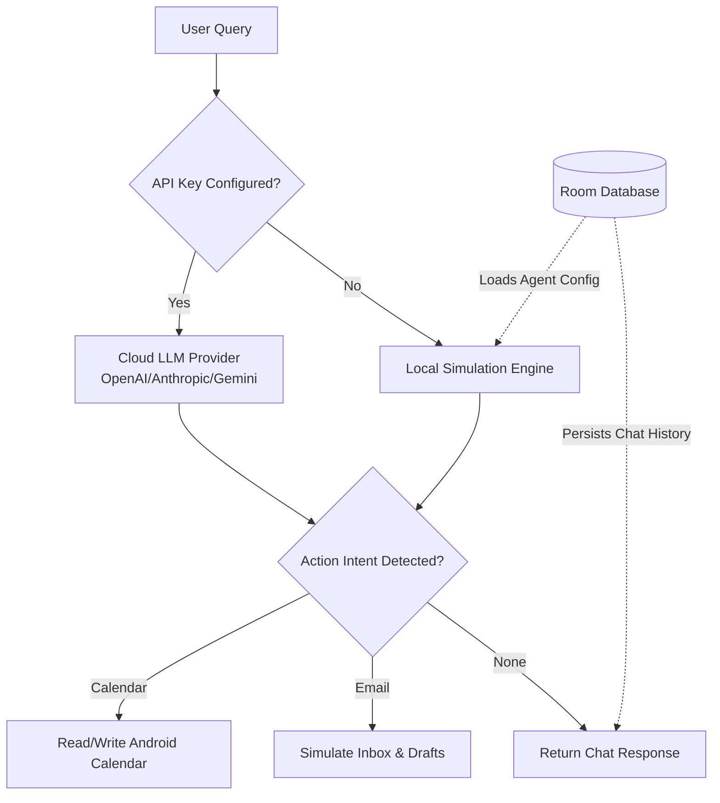

<div align="center">

# 🤖 On-Device AI Agent (V2)

**A native Android automation assistant that manages your device natively. Run powerful LLMs via API, or switch to the Fully Offline Simulated Agent engine to execute mock profiles of industry-leading AI agents (OpenHands, CrewAI, AutoGen) right on your phone.**

[](https://developer.android.com/)
[](https://kotlinlang.org/)
[](https://developer.android.com/jetpack/compose)
[](LICENSE)

<br>

[](https://github.com/testencomnom-collab/on-device-agent/raw/main/releases/on-device-agent-V2.apk)

</div>

---

## ✨ Key Features (V2 Update)

- 🔌 **Fully Offline Simulated Agents**: Download JSON configurations for complex frameworks like **OpenHands, Goose, Browser-Use, CrewAI, and Flowise**. Each agent gets its own isolated, persistent chat history and dynamically adjusted system prompt.
- 📱 **Mobile Automation Engine**: Automatically parses intents to execute complex system actions like booking calendar events or drafting emails based on conversational queries.
- 🔑 **Dynamic Runtime Permissions**: Native handling for standard Android runtime permissions (Calendar, Contacts, Location) to safely coordinate local task routing.
- 🧠 **Multi-LLM Integration**: Connect your own API keys for OpenAI (GPT-4o), Anthropic (Claude 3.5), or Google Gemini for maximum reasoning power.
- 🗄️ **Local Security & Room Database**: Complete local persistence of chat flows, inbox tables, downloaded agent configurations, and encrypted API preferences.

---

## 🏗️ Architecture Flow

The app dynamically routes your requests either through a real LLM endpoint or a simulated local prompt engine based on the active agent selected in the UI.



---

## 📚 Supported Local Agent Profiles

You can browse and download these agent profiles directly from the in-app library.

| Agent Framework | Category | Purpose |
|-----------------|----------|---------|
| **OpenHands** | Coding | Simulates an autonomous software engineer. |
| **Goose** | Terminal | Terminal and local environment assistant. |
| **CrewAI** | Multi-Agent | Simulates specialized teams (Researcher, Writer, Critic). |
| **AutoGen** | Multi-Agent | Microsoft's framework for multi-agent discussions. |
| **Browser-Use** | Web Auto | Web navigation and headless browser automation concepts. |
| **Flowise** | Visual | Drag-and-drop customized LLM flows. |

---

## 🛠️ Tech Stack

| Category | Technology |
|----------|-----------|
| **Language** | Kotlin 2.0 |
| **UI Framework** | Jetpack Compose + Material Design 3 |
| **Networking** | Retrofit + OkHttp + Moshi |
| **Database** | Room (SQLite) |
| **Architecture** | MVVM with Repository Pattern |
| **Build System** | Gradle (Kotlin DSL) with Version Catalog |

---

## 🚀 Getting Started

### Prerequisites

- [Android Studio](https://developer.android.com/studio) (latest stable)
- Android SDK 36
- A physical device or emulator running Android 7.0+ (API 24+)

### Setup

1. **Clone the repository**
   ```bash
   git clone https://github.com/testencomnom-collab/on-device-agent.git
   cd on-device-agent
   ```

2. **Open in Android Studio**
   Select **File → Open** and choose the project directory.

3. **Configure API Keys**
   Create a `.env` file in the project root to securely inject keys into the build process:
   ```env
   GEMINI_API_KEY=your_gemini_api_key_here
   ```

4. **Run the app**
   Build and run on an emulator or physical device via Android Studio.

---

## 🔒 Security

- API keys are stored locally on-device and **never** transmitted to unauthorized third parties.
- The `.env` file containing your build API keys is excluded from version control via `.gitignore`.
- Release signing keystores are **not** included in the repository.

---

## 📄 License

This project is licensed under the MIT License — see the [LICENSE](LICENSE) file for details.

---

<div align="center">

**Built with ❤️ using Kotlin & Jetpack Compose**

</div>
