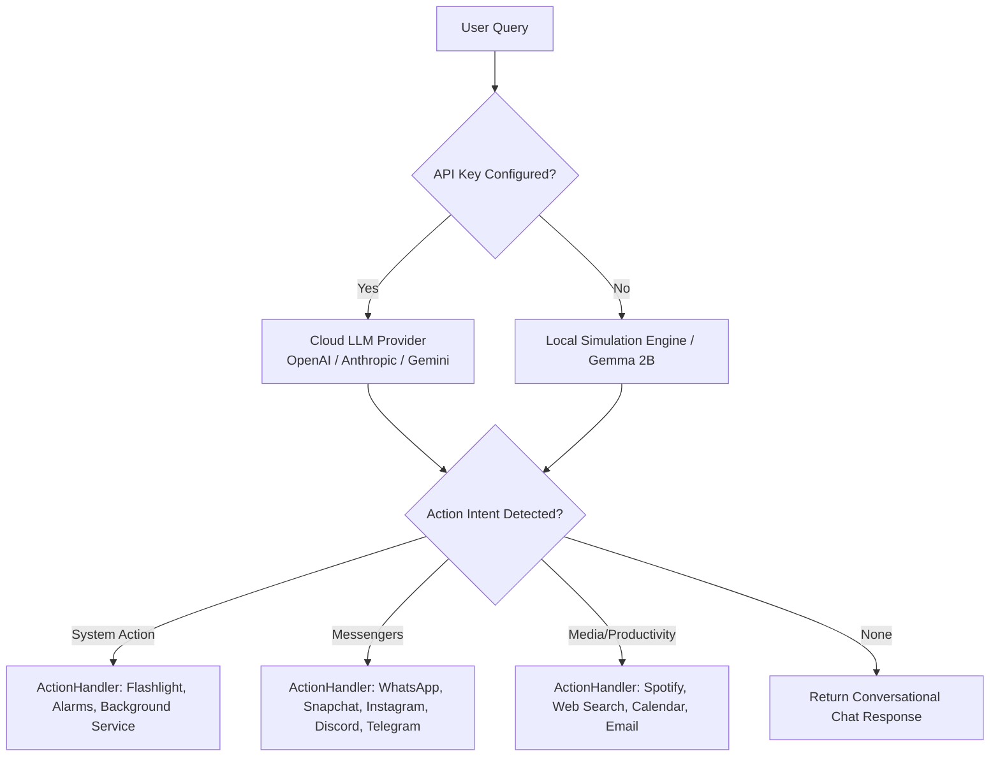

<div align="center">

# 🤖 On-Device AI Agent

**A native Android automation assistant that manages your device natively. Run powerful LLMs via API, or switch to the Fully Offline Simulated Agent engine to execute mock profiles of industry-leading AI agents (OpenHands, CrewAI, AutoGen) right on your phone.**

[](https://developer.android.com/)
[](https://kotlinlang.org/)
[](https://developer.android.com/jetpack/compose)
[](LICENSE)
[](https://github.com/testencomnom-collab/on-device-agent/releases)

<br>

[](https://github.com/testencomnom-collab/on-device-agent/raw/main/releases/synaptiq-ai-agent-V18-crash-fixes.apk)

</div>

---

## 🌟 Vision & Overview
Welcome to the future of mobile assistance! The **On-Device AI Agent** acts as an intelligent bridge between advanced Large Language Models (LLMs) and your Android device's native ecosystem. Whether you're connected to the cloud or completely offline, this agent seamlessly parses conversational language and executes real actions on your smartphone—from sending WhatsApp messages to tweaking system settings.

---

## ✨ Key Features

1. 📲 **Messenger Automation**  
   Full deep-link and intent integration to directly send messages via **WhatsApp, Snapchat, Instagram, Telegram, and Discord**.
   
2. 🔦 **Hardware & System Utilities**  
   Voice-driven control over hardware functions like **Flashlight**, managing **Alarms & Timers**, seamless **Spotify playback**, and fast **Web Searches**.
   
3. 🧠 **True On-Device LLM (Gemma 2B)**  
   Download and run the actual **1.35 GB Gemma 2B model** via MediaPipe. The processing happens entirely offline without requiring an internet connection—guaranteeing 100% privacy.

4. 🧠 **Langzeit-Gedächtnis (Contextual Memory)**  
   **Das Feature ist vollständig implementiert!**  
   **Wie es funktioniert:** Die KI speichert bestimmte Fakten über dich dauerhaft ab (z.B. Namen deiner Freunde, deinen Arbeitsort, deine Lieblingsmusik) in einer sicheren Room-Datenbank. Über ein neues Gehirn-Icon (Brain UI) in der oberen Leiste der App kannst du alle von der KI gelernten Erinnerungen live einsehen, einzeln per Papierkorb löschen oder das gesamte Gedächtnis zurücksetzen.

5. 🎨 **Beautiful Modern UI & Multilanguage**  
   A sleek, dark-mode focused UI with a brand new custom app icon, dynamic animations, and premium glassmorphic elements. 
   **Mehrsprachigkeit:** Die App und das LLM unterstützen dynamisch Englisch und Deutsch, ohne Sprachmischmasch.

6. 🔌 **Fully Offline Simulated Agents**  
   Download JSON configurations for complex frameworks like **OpenHands, Goose, Browser-Use, CrewAI, and Flowise**. The app simulates how these complex AI workflows operate on a mobile layout.

7. 📱 **Mobile Automation Engine**  
   Automatically parses complex user intents (like "Book a flight on Tuesday and invite John") to execute complex system actions like booking calendar events or drafting emails based on conversational queries.

8. 🚀 **Autonomer KI-Agent (Autopilot Mode)**  
   Läuft im Hintergrund als Foreground Service mit CPU-WakeLock. Implementiert einen vollständigen **Think-Act-Observe Loop**: Der Agent kann selbstständig nachdenken (`THINK`), Handlungen ausführen (`SYSTEM_ACTION`) und den aktuellen Bildschirminhalt lesen (`OBSERVE`). Inklusive sicherem Kill-Switch (Stop-Button) in der UI.

9. 📜 **Auto-Scroll Navigation**  
   Der Agent kann native UI-Elemente durchsuchen und selbstständig scrollen (`SCROLL_DOWN` / `SCROLL_UP`), um mehr Kontext zu erhalten, falls das gewünschte Element nicht sofort sichtbar ist.

---

## 🏗️ Architecture Flow

The heavy lifting for Android Intents and System Automations is completely decoupled into a dedicated `ActionHandler` and a robust `AgentAccessibilityService`. Everything runs seamlessly in the background!



---

## 🔬 Deep Dive: Wie die Automatisierung wirklich funktioniert

Gerne lassen wir uns wirklich tief in den Code abtauchen. Android hat sehr strenge Sicherheitsrichtlinien (Sandboxing), weshalb eine App eigentlich nicht einfach andere Apps fernsteuern darf. Um "alles" zu automatisieren, mussten wir ein paar extrem mächtige Android-Features kombinieren. Hier ist die **extrem genaue** Erklärung, aufgeteilt in die drei Bausteine unseres Systems:

### 1. Das Gehirn: Prompting & JSON-Routing (`LLMAgentService.kt`)
Zuerst muss die KI (egal ob Cloud-API oder lokales Gemma-Modell) verstehen, dass sie nicht nur chatten, sondern *handeln* soll. 
Dafür haben wir ihr einen strikten "System Prompt" geschrieben:
```json
{
   "hasAction": true,
   "actionType": "SYSTEM_ACTION",
   "systemAction": {
      "targetApp": "whatsapp",
      "recipient": "Max",
      "instruction": "Hallo, bin gleich da!"
   }
}
```
Die KI zwingt sich selbst, genau dieses JSON zurückzugeben. Unser Kotlin-Code fängt dieses JSON ab, parst es und schickt es an unseren `ActionHandler`.

### 2. Die System-Hardware & Intents (`ActionHandler.kt`)
Wenn das JSON im `ActionHandler` ankommt, wird als erstes geprüft, was unter `targetApp` steht. Hier nutzen wir native Android **Intents** (systemweite Botschaften) und System-Services.

**A. Die Taschenlampe (Hardware-Service)**
```kotlin
"flashlight" -> {
    // 1. Hole dir den direkten Draht zum Hardware-Kamera-Dienst von Android
    val cameraManager = context.getSystemService(Context.CAMERA_SERVICE) as CameraManager
    // 2. Finde die ID der primären Rückkamera (id 0)
    val cameraId = cameraManager.cameraIdList[0] 
    // 3. Schalte den Strom für den LED-Blitz ("Torch Mode") ein
    cameraManager.setTorchMode(cameraId, true) 
}
```
Das passiert ohne Umwege in Millisekunden direkt auf dem Mainboard deines Handys.

**B. Timer & Wecker (System Intents)**
Hier nutzen wir die `AlarmClock`-API. Anstatt die Uhr-App zu öffnen und zu klicken, rufen wir sie über das System auf und übergeben direkt die Parameter:
```kotlin
"timer" -> {
    val intent = Intent(AlarmClock.ACTION_SET_TIMER).apply {
        putExtra(AlarmClock.EXTRA_LENGTH, 300) // 5 Minuten in Sekunden
        putExtra(AlarmClock.EXTRA_MESSAGE, "AI Timer")
        putExtra(AlarmClock.EXTRA_SKIP_UI, false) // Timer direkt im Hintergrund starten
        addFlags(Intent.FLAG_ACTIVITY_NEW_TASK)
    }
    context.startActivity(intent) // Feuert den Intent ans System
}
```

**C. Spotify (Media Intents)**
Anstatt in Spotify nach einem Song zu suchen, nutzen wir einen speziellen Media-Search-Intent:
```kotlin
"spotify" -> {
    val intent = Intent(Intent.ACTION_MAIN).apply {
        action = "android.media.action.MEDIA_PLAY_FROM_SEARCH" // Spezielle Android Aktion
        setPackage("com.spotify.music") // Zwingt Android, diesen Befehl NUR an Spotify zu senden
        putExtra(SearchManager.QUERY, "Shape of You") // Der gesuchte Song/Artist
        addFlags(Intent.FLAG_ACTIVITY_NEW_TASK)
    }
    context.startActivity(intent)
}
```

### 3. Die Geisterhand (`AgentAccessibilityService.kt`)
Was aber, wenn wir Apps bedienen wollen, die keine solchen "Intents" anbieten? Zum Beispiel Instagram Direct, WhatsApp oder Snapchat. Hier kommt die "Geisterhand" zum Einsatz.
Wir haben einen eigenen **AccessibilityService** programmiert. Das ist eine System-Berechtigung, die du in den Android-Einstellungen manuell erlauben musst. Ist sie aktiv, hat unsere App "Root-ähnliche" Sicht auf den gesamten Bildschirm.

Wenn der `ActionHandler` sieht, dass eine Nachricht über WhatsApp geschickt werden soll:
1. Schreibt er Ziel ("Max") und Nachricht in ein globales `AutomationState`-Objekt.
2. Er öffnet WhatsApp über einen simplen App-Start-Intent (`context.packageManager.getLaunchIntentForPackage("com.whatsapp")`).

Jetzt übernimmt der **AccessibilityService**, der bei jeder noch so kleinen Bildschirmänderung (Event) vom Android-System gerufen wird:

**Schritt 1: Den Kontakt finden und klicken**
```kotlin
val rootNode = rootInActiveWindow // Liest alle aktuell sichtbaren Elemente (Texte, Buttons) des Bildschirms aus
val contactNodes = rootNode.findAccessibilityNodeInfosByText("Max") // Sucht nach dem Namen
if (contactNodes.isNotEmpty()) {
    val node = contactNodes.first()
    // Simuliert einen physischen Touch-Klick des Users auf dieses Element!
    node.performAction(AccessibilityNodeInfo.ACTION_CLICK) 
    AutomationState.step = 2 // Geht zum nächsten Schritt über
}
```

**Schritt 2: Nachricht tippen & Senden Button finden**
*(Da das Einfügen des Textes über die System-Zwischenablage in einer anderen Datei geschieht, suchen wir im Service nur nach dem "Senden" Knopf)*
```kotlin
// Der Service scannt den Chat nach dem Text "Senden" (oder dem WhatsApp View-ID für den Button)
val finalSendNodes = rootNode.findAccessibilityNodeInfosByViewId("com.whatsapp:id/send")
val descNodes = rootNode.findAccessibilityNodeInfosByText("Senden")
val allFinal = finalSendNodes + descNodes

if (allFinal.isNotEmpty()) {
    val btn = allFinal.first()
    btn.performAction(AccessibilityNodeInfo.ACTION_CLICK) // Klickt "Senden"
    AutomationState.isRunning = false // Geisterhand schaltet sich ab
}
```

**Das Geniale daran:** Diese `AccessibilityEvents` feuern hunderte Male pro Sekunde. Der Such-und-Klick-Vorgang passiert so unfassbar schnell, dass das menschliche Auge fast nicht mitkommt. Es sieht buchstäblich so aus, als würde ein unsichtbarer Geist dein Handy in Rekordgeschwindigkeit bedienen!

---

## 📚 Supported Local Agent Profiles

Browse and download agent profiles directly from the in-app library.

| Agent Framework | Category | Purpose |
|-----------------|----------|---------|
| 🤖 **OpenHands** | Coding | Simulates an autonomous software engineer. |
| 🦅 **Goose** | Terminal | Terminal and local environment assistant. |
| 👥 **CrewAI** | Multi-Agent | Simulates specialized teams (Researcher, Writer, Critic). |
| 💬 **AutoGen** | Multi-Agent | Microsoft's framework for multi-agent discussions. |
| 🌐 **Browser-Use** | Web Auto | Web navigation and headless browser automation concepts. |
| 🧩 **Flowise** | Visual | Drag-and-drop customized LLM flows. |

---

## 🛠️ Tech Stack

| Category | Technology |
|----------|-----------|
| **Language** | Kotlin 2.0 |
| **UI Framework** | Jetpack Compose + Material Design 3 |
| **Networking** | Retrofit + OkHttp + Moshi |
| **Database** | Room (SQLite) |
| **Architecture** | MVVM with Repository Pattern & ActionHandler |
| **Build System** | Gradle 9.5.1 (Kotlin DSL) with Version Catalog |
| **AI Inference** | Google MediaPipe LLM Inference Task |

---

## 🚀 Getting Started

### Prerequisites
- [Android Studio](https://developer.android.com/studio) (latest stable)
- Android SDK 36
- A physical device or emulator running Android 7.0+ (API 24+)

### Setup

1. **Clone the repository**
   ```bash
   git clone https://github.com/testencomnom-collab/on-device-agent.git
   cd on-device-agent
   ```

2. **Open in Android Studio**
   Select **File → Open** and choose the project directory.

3. **Configure API Keys** (Optional)
   You can securely inject default keys via a `.env` file (the app also supports entering keys securely at runtime via UI).
   ```env
   GEMINI_API_KEY=your_gemini_api_key_here
   ```

4. **Run the App**
   Hit `Run` (Shift+F10) in Android Studio to deploy the agent directly to your physical device.

---

## 🔒 Privacy & Security

- **Zero API Leaks:** Extensive security audits guarantee that no API keys or sensitive credentials are inadvertently exposed in the codebase.
- **On-Device Execution:** API keys are stored safely within the Android encrypted `SharedPreferences`.
- **Local Autonomy:** For ultimate privacy, utilizing the Gemma 2B model ensures zero bytes of query data are ever transmitted to the internet.

---

## 🤝 Contribution
Contributions are welcome! Please feel free to submit a Pull Request, open issues to report bugs, or suggest new features to make the Agent even smarter.

---

<div align="center">

**Built with ❤️ using Kotlin & Jetpack Compose**

<br>


</div>
