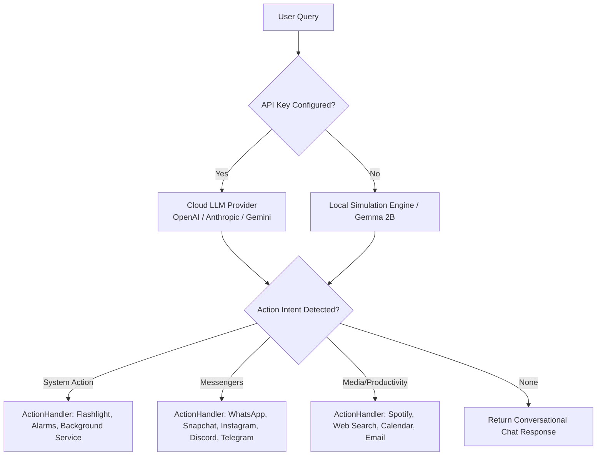

<div align="center">

# 🤖 On-Device AI Agent

**A native Android automation assistant that manages your device natively. Run powerful LLMs via API, or switch to the Fully Offline Simulated Agent engine to execute mock profiles of industry-leading AI agents (OpenHands, CrewAI, AutoGen) right on your phone.**

[](https://developer.android.com/)
[](https://kotlinlang.org/)
[](https://developer.android.com/jetpack/compose)
[](LICENSE)
[](https://github.com/testencomnom-collab/on-device-agent/releases)

<br>

[](https://github.com/testencomnom-collab/on-device-agent/raw/main/releases/on-device-agent-V12-bugfixes.apk)

</div>

---

## 🌟 Vision & Overview
Welcome to the future of mobile assistance! The **On-Device AI Agent** acts as an intelligent bridge between advanced Large Language Models (LLMs) and your Android device's native ecosystem. Whether you're connected to the cloud or completely offline, this agent seamlessly parses conversational language and executes real actions on your smartphone—from sending WhatsApp messages to tweaking system settings.

---

## ✨ Key Features

1. 📲 **Messenger Automation**  
   Full deep-link and intent integration to directly send messages via **WhatsApp, Snapchat, Instagram, Telegram, and Discord**.
   
2. 🔦 **Hardware & System Utilities**  
   Voice-driven control over hardware functions like **Flashlight**, managing **Alarms & Timers**, seamless **Spotify playback**, and fast **Web Searches**.
   
3. 🧠 **True On-Device LLM (Gemma 2B)**  
   Download and run the actual **1.35 GB Gemma 2B model** via MediaPipe. The processing happens entirely offline without requiring an internet connection—guaranteeing 100% privacy.

4. 🧠 **Langzeit-Gedächtnis (Contextual Memory)**  
   *Aktuell ist der Chat wahrscheinlich relativ kurzlebig.*  
   **Wie es funktioniert:** Die KI speichert bestimmte Fakten über dich dauerhaft ab (z.B. Namen deiner Freunde, deinen Arbeitsort, deine Lieblingsmusik). Wenn du sagst "Spiele meine Lieblingsmusik", weiß sie ohne Nachfragen, dass sie Spotify öffnen und "Daft Punk" abspielen muss, weil sie sich das aus einem Chat vor 3 Wochen gemerkt hat.

5. 🎨 **Beautiful Modern UI**  
   A sleek, dark-mode focused UI with a brand new custom app icon, dynamic animations, and premium glassmorphic elements. Multilanguage support included!

6. 🔌 **Fully Offline Simulated Agents**  
   Download JSON configurations for complex frameworks like **OpenHands, Goose, Browser-Use, CrewAI, and Flowise**. The app simulates how these complex AI workflows operate on a mobile layout.

7. 📱 **Mobile Automation Engine**  
   Automatically parses complex user intents (like "Book a flight on Tuesday and invite John") to execute complex system actions like booking calendar events or drafting emails based on conversational queries.

---

## 🏗️ Architecture Flow

The heavy lifting for Android Intents and System Automations is completely decoupled into a dedicated `ActionHandler` and a robust `AgentAccessibilityService`. Everything runs seamlessly in the background!



---

## 📚 Supported Local Agent Profiles

Browse and download agent profiles directly from the in-app library.

| Agent Framework | Category | Purpose |
|-----------------|----------|---------|
| 🤖 **OpenHands** | Coding | Simulates an autonomous software engineer. |
| 🦅 **Goose** | Terminal | Terminal and local environment assistant. |
| 👥 **CrewAI** | Multi-Agent | Simulates specialized teams (Researcher, Writer, Critic). |
| 💬 **AutoGen** | Multi-Agent | Microsoft's framework for multi-agent discussions. |
| 🌐 **Browser-Use** | Web Auto | Web navigation and headless browser automation concepts. |
| 🧩 **Flowise** | Visual | Drag-and-drop customized LLM flows. |

---

## 🛠️ Tech Stack

| Category | Technology |
|----------|-----------|
| **Language** | Kotlin 2.0 |
| **UI Framework** | Jetpack Compose + Material Design 3 |
| **Networking** | Retrofit + OkHttp + Moshi |
| **Database** | Room (SQLite) |
| **Architecture** | MVVM with Repository Pattern & ActionHandler |
| **Build System** | Gradle 9.5.1 (Kotlin DSL) with Version Catalog |
| **AI Inference** | Google MediaPipe LLM Inference Task |

---

## 🚀 Getting Started

### Prerequisites
- [Android Studio](https://developer.android.com/studio) (latest stable)
- Android SDK 36
- A physical device or emulator running Android 7.0+ (API 24+)

### Setup

1. **Clone the repository**
   ```bash
   git clone https://github.com/testencomnom-collab/on-device-agent.git
   cd on-device-agent
   ```

2. **Open in Android Studio**
   Select **File → Open** and choose the project directory.

3. **Configure API Keys** (Optional)
   You can securely inject default keys via a `.env` file (the app also supports entering keys securely at runtime via UI).
   ```env
   GEMINI_API_KEY=your_gemini_api_key_here
   ```

4. **Run the App**
   Hit `Run` (Shift+F10) in Android Studio to deploy the agent directly to your physical device.

---

## 🔒 Privacy & Security

- **Zero API Leaks:** Extensive security audits guarantee that no API keys or sensitive credentials are inadvertently exposed in the codebase.
- **On-Device Execution:** API keys are stored safely within the Android encrypted `SharedPreferences`.
- **Local Autonomy:** For ultimate privacy, utilizing the Gemma 2B model ensures zero bytes of query data are ever transmitted to the internet.

---

## 🤝 Contribution
Contributions are welcome! Please feel free to submit a Pull Request, open issues to report bugs, or suggest new features to make the Agent even smarter.

---

<div align="center">

**Built with ❤️ using Kotlin & Jetpack Compose**

<br>


</div>
